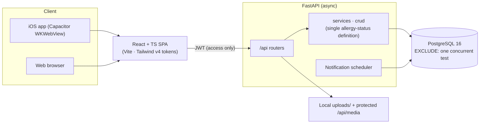

# MammaCare — Baby Food Allergy Safety Tracker

[](https://github.com/mhju0/mammacare-ios/actions/workflows/ci.yml)

A mobile-first app that helps parents introduce solid foods to their baby safely: start one new ingredient at a time, observe for 72 hours, and log any allergic reaction. Allergy status is always shown as a **traffic light** — green (safe), amber (testing), red (reaction) — so a tired parent can read state at a glance.

`FastAPI (async) · PostgreSQL 16 · React + TypeScript · Vite · Tailwind v4 · Capacitor (iOS)`

> **Project origin.** MammaCare began as a bootcamp **team** project. This repository is the **solo continuation** — I narrowed the scope to allergy safety, removed the cloud/AI dependencies, redesigned the UI, and packaged it for iOS independently. The scope decision, re-architecture, design system, and iOS build in this repo are my own work.

<p align="center">
  
  
  
  
</p>
<p align="center">
  <em>Dashboard · Ingredient stamp grid · 72-hour observation · Report</em>
</p>

<p align="center">
  <br/>
  <em>Money moment: re-testing a previously-reacted ingredient requires an explicit safety confirmation.</em>
</p>

▶️ **[1-minute demo video (iOS simulator recording, mp4)](https://github.com/mhju0/mammacare-ios/releases/download/v0.9-demo/mammacare-demo-1min.mp4)**

---

## The problem

In early weaning, parents introduce one new ingredient at a time and watch for a few days — an allergic reaction (rash, vomiting, diarrhea) can surface anywhere from a few hours to three days later. Keeping track of *what was eaten when, and what happened after* is hard to do from memory, and it's exactly the information you can't afford to lose.

## What makes it different

- **One problem, done well.** Not an all-in-one parenting app — it focuses on the single highest-severity concern: safe ingredient introduction.
- **Color is the interface.** Safe = green, testing = amber, reaction = red, with icons and text alongside so meaning is never carried by color alone.
- **Matched by `ingredient_id`, not by name.** Allergen comparison uses stable identifiers rather than string matching, reducing false negatives from naming mismatches.

## Screens

| Screen | What it does |
|---|---|
| **Home (dashboard hero)** | Traffic-light summary (safe / testing / reaction counts) → next-ingredient suggestions → active test progress → recent history |
| **Ingredients** | 145-ingredient ink-stamp grid colored by status, with search and stage filters. Ingredients with a reaction history trigger the **retest consent gate** |
| **Observe** | 72-hour observation timeline for the active test, with per-milestone symptom logging |
| **Report** | Aggregated allergy report with PDF / JPG download for sharing at a pediatric visit |
| **Allergy management** | Safe / reaction / confirmed ingredient lists, cross-reactivity analysis, nearby-hospital lookup |

## Key engineering decisions

1. **Scoped down to allergy safety.** Cut a broad parenting app to the one problem with the highest stakes, trading breadth for depth and completeness.
2. **Removed cloud/AI dependencies.** Dropped Azure OpenAI / Speech / Language / Blob and the AI chatbot, meal planner, and STT. Images are stored locally under `backend/uploads/` behind a protected `/api/media` endpoint — the app runs end-to-end on localhost with no cloud keys, which makes it trivial to reproduce and demo.
3. **Traffic-light design system.** Semantic status colors (safe / testing / reaction) are tokenized in `theme.css`; components pair color with an icon and label so state is accessible.
4. **Manual SQL instead of Alembic.** Structural changes live in `backend/manual_sql/` as verifiable scripts (`BEGIN/COMMIT` with pre/post `SELECT`), explicitly handling the fact that `create_all()` won't alter existing tables.
5. **Dropped a leftover UNIQUE constraint that blocked retesting.** `uq_ingredient_testing_baby_ingredient` permanently prevented re-testing a completed ingredient. Removed via [`001_drop_ingredient_testing_full_unique.sql`](backend/manual_sql/001_drop_ingredient_testing_full_unique.sql), while keeping the `ex_ingredient_testing_no_overlap` EXCLUDE constraint that enforces **one concurrent test per baby**.
6. **Cross-reactivity warnings are a name-based heuristic (a secondary aid).** Warnings use string matching (`CROSS_REACTIVITY_MAP`); the primary allergy decision stays `ingredient_id`-based. Naming mismatches can miss a warning — a known limitation.

## Tech stack

| Area | Technology |
|---|---|
| Backend | FastAPI, async SQLAlchemy, PostgreSQL 16, JWT (access-only), httpx, async scheduler |
| Frontend | React 18 + TypeScript, Vite, Tailwind v4 (CSS tokens), React Router, pnpm |
| Mobile | Capacitor (iOS simulator target) |
| Other | Local image storage, FCM push (when keys present) |

## Architecture



## Run locally

Full setup (PostgreSQL 16 + dump restore) is in [`SETUP.md`](SETUP.md). In short:

```bash
# backend
cd backend && source ../venv/bin/activate && uvicorn app.main:app --reload   # http://localhost:8000/docs
# frontend
cd frontend && pnpm install && pnpm dev                                      # http://localhost:5173
```

Smoke check without starting the servers:

```bash
cd backend && ../venv/bin/python -c "import app.main"   # backend imports
cd frontend && pnpm build                               # frontend builds
```

## Docs

- [`DESIGN_SYSTEM.md`](DESIGN_SYSTEM.md) — color tokens, components, traffic-light principle
- [`SETUP.md`](SETUP.md) — local setup
