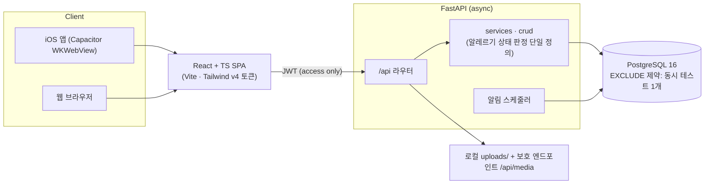

# MammaCare — 이유식 알레르기 안전 추적 도구

[](https://github.com/mhju0/mammacare-personal/actions/workflows/ci.yml)

> 아기가 처음 먹는 재료 하나하나를, **안전하게 도입하고 반응을 놓치지 않도록** 돕는 모바일 우선 웹앱.
> 알레르기 상태를 **신호등(초록·노랑·빨강)** 으로 보여 주는 것이 제품의 핵심이다.

`FastAPI(async) · PostgreSQL 16 · React + TypeScript · Vite · Tailwind v4 · Capacitor(iOS)`

**TL;DR (English).** MammaCare is a mobile-first app that helps parents introduce solid foods to their baby safely: start one new ingredient at a time, observe for 72 hours, and log any allergic reaction. Allergy status is always shown as a traffic light (green = safe, amber = testing, red = reaction), reactions are matched by `ingredient_id` rather than name strings, and re-testing a previously-reacted ingredient requires an explicit safety confirmation. Solo portfolio project: async FastAPI + PostgreSQL backend, React/TypeScript frontend, packaged for iOS with Capacitor, fully self-contained on localhost (no cloud keys needed). 145 seeded ingredients, 112 API endpoints, doctor-shareable PDF/JPG reports.

<!-- iOS 시뮬레이터(iPhone 17 · iOS 26.1) 실캡처 -->
| 대시보드 (신호등 히어로) | 도감 (잉크 스탬프) | 72시간 관찰 | 재테스트 동의 게이트 |
|---|---|---|---|
|  |  |  |  |

---

## 한 줄 정의

이유식을 시작한 영아 부모가 **새 재료를 하나씩 도입 → 72시간 관찰 → 안전/반응을 기록**하는 과정을 안전하게 관리하는 도구.

### 문제
- 이유식 초기에는 새로운 재료를 하루 한 가지씩, 며칠에 걸쳐 관찰하며 도입해야 한다. 반응(발진·구토·설사 등)은 몇 시간~사흘 뒤에 나타날 수 있다.
- 부모는 "무엇을 언제 먹였고, 어떤 반응이 있었는지"를 머리로 기억하기 어렵다. 지치고 정신없는 상황에서 **놓치면 안 되는 정보**가 흩어진다.

### 사용자
- 이유식을 막 시작했거나 진행 중인 **영아의 보호자**. 모바일에서 짧게, 자주 확인한다.

### 차별점
- **알레르기 안전 한 가지에 집중.** 종합 육아앱이 아니라, "재료 도입 안전"이라는 가장 심각도 높은 문제를 깊게 판다.
- **색이 곧 기능.** 안전=초록, 테스트중=노랑, 반응=빨강. 지친 부모가 한눈에 상태를 읽는다.
- **이름이 아니라 `ingredient_id`로 비교.** 알레르겐 매칭을 문자열이 아닌 식별자로 하여 오탐/누락을 줄인다.

---

## 주요 화면

로그인 + 활성 아기 프로필이 있으면 홈이 **알레르기 대시보드(신호등 히어로)** 로 바뀐다. 그 외(비로그인/아기 미등록)는 마케팅 홈을 유지한다. (`frontend/src/pages/HomeRoute.tsx`)

| 화면 | 설명 |
|---|---|
| **홈(대시보드 히어로)** | 신호등 요약(안전/테스트중/반응 카운트) → 다음 도입 추천 → 진행 중 테스트 진행바 → 최근 기록 |
| **도감** | 145종 식재료 잉크-스탬프 그리드(상태별 잉크색), 검색·단계 필터, 테스트 시작. 반응 이력 재료는 **재테스트 동의 게이트** |
| **관찰** | 진행 중 테스트의 72시간 관찰 타임라인 — 마일스톤별 증상 기록 |
| **리포트** | 알레르기 기록 종합 리포트 미리보기 + PDF/JPG 다운로드(진료 공유용) |
| **알레르기 관리** | 안전/반응/확정 재료 관리, 교차반응 의심 분석, 주변 병원 안내 |

리포트 화면 캡처: 

---

## 핵심 의사결정 (하이라이트)

자세한 맥락은 [`AGENTS.md`](AGENTS.md), [`DESIGN_SYSTEM.md`](DESIGN_SYSTEM.md)와 [케이스 스터디 초안](docs/CASE_STUDY.draft.md) 참조.

1. **범위를 "이유식 알레르기 안전"으로 좁힘.** 종합 맘마케어에서 가장 심각도 높은 문제 하나로 집중해 솔로 포트폴리오로 완결성을 높임.
2. **AI/클라우드 의존 제거(부활 금지).** Azure OpenAI·Speech·Language·Blob, AI 챗봇/식단, STT, NLP, Content Safety 제거. 이미지는 로컬 `backend/uploads/` + 보호 엔드포인트 `/api/media`. → **Azure 없이 로컬에서 완결**되어 재현·시연이 쉽다.
3. **신호등 디자인 시스템.** Clinic(의료 신뢰) 블루 + 자연 세이지 베이스에 시맨틱 상태색(safe/testing/reaction)을 토큰화. 색만으로 의미 전달하지 않도록 아이콘+텍스트 병행(`StatusChip`).
4. **Alembic 대신 수동 SQL.** 구조 변경은 `backend/manual_sql/`의 검증형 SQL(`BEGIN/COMMIT` + pre/post `SELECT`)로 관리. `create_all()`이 제약/타입을 자동 변경하지 않는 한계를 명시적으로 다룸.
5. **재테스트를 막던 잔재 UNIQUE 제약 제거.** `uq_ingredient_testing_baby_ingredient`(한 아기+한 재료 전체 기간 1회)가 "완료한 재료의 재테스트"를 영구히 막고 있었음 → [`001_drop_ingredient_testing_full_unique.sql`](backend/manual_sql/001_drop_ingredient_testing_full_unique.sql)로 제거. **동시 1개 테스트**를 강제하는 `ex_ingredient_testing_no_overlap`(EXCLUDE)은 그대로 유지.
6. **교차반응 경고는 이름 기반 휴리스틱(보조 기능).** 재료명 문자열 매칭(`CROSS_REACTIVITY_MAP`)으로 경고. 메인 알레르기 판정은 `ingredient_id` 기반으로 분리. 표기 불일치 시 경고 누락 가능(한계).

---

## 기술 스택

| 영역 | 기술 |
|---|---|
| Backend | FastAPI, async SQLAlchemy, PostgreSQL 16, JWT(access only), httpx, 비동기 스케줄러 |
| Frontend | React 18 + TypeScript, Vite, Tailwind v4(CSS 토큰), React Router, pnpm |
| Mobile | Capacitor(iOS 시뮬레이터 타깃) |
| 기타 | 로컬 이미지 저장, FCM 푸시(키 있을 때), OAuth(fragment 토큰 + HMAC state) |

---

## 로컬 실행

전체 절차는 [`SETUP.md`](SETUP.md) 참조 (PostgreSQL 16 + 덤프 복원 포함). 요약:

```bash
# backend
cd backend && source ../venv/bin/activate && uvicorn app.main:app --reload   # http://localhost:8000/docs
# frontend
cd frontend && pnpm install && pnpm dev                                      # http://localhost:5173
```

최소 검증(서버 기동 없이):

```bash
cd backend && ../venv/bin/python -c "import app.main"   # 백엔드 임포트 OK
cd frontend && pnpm build                               # 프론트 빌드 OK
```

> 로컬에서 되는 것: 이메일 가입/로그인, 아기, 일정, 레시피·재료, 알레르기, 커뮤니티, 이미지(로컬). 키가 있어야 하는 것: FCM 푸시, OAuth.

---

## 아키텍처 요약



```
backend/app/main.py        FastAPI entry / lifespan(create_all) / scheduler
backend/app/api/           라우터 (/api 아래 mount, /api/v1 미사용)
backend/app/services/      비즈니스 로직, 스케줄러
backend/app/crud/          DB 헬퍼
backend/app/models/        SQLAlchemy ORM
backend/app/schemas/       Pydantic 모델
backend/manual_sql/        수동 DB 변경 SQL(+ 적용 순서/검증 쿼리)
frontend/src/pages/        화면별 페이지 (Dashboard = 신호등 히어로)
frontend/src/components/ui/ 디자인 시스템 컴포넌트(StatusChip 등)
frontend/src/styles/theme.css 색 토큰(:root) + Tailwind @theme 매핑
```

알레르기 관련 핵심 규칙은 [`AGENTS.md`](AGENTS.md)의 "알레르기 규칙" 절을 1차 진실로 본다.

---

## 1분 데모 시나리오

1. 이메일로 로그인하고 아기 프로필을 선택한다 → 홈이 **알레르기 대시보드**로 전환.
2. 상단 **신호등 요약**에서 안전/테스트중/반응 개수를 한눈에 본다.
3. **"다음 도입 추천"** 또는 **도감 스탬프 그리드**에서 월령에 맞는 새 재료를 고른다.
4. 재료의 **테스트를 시작** → 관찰 탭에 72시간 관찰 타임라인이 생긴다. (반응 이력이 있는 재료면 **동의 게이트**가 먼저 뜬다.)
5. 시간 경과 마일스톤마다 **증상을 기록**한다. 이상 없으면 안전(초록), 반응이 있으면 빨강으로 표시.
6. 결과가 쌓이면 **리포트(PDF/JPG)** 로 내려받아 진료 때 공유한다.

> 핵심 메시지: "**한 재료씩, 안전하게, 놓치지 않게.**"

---

## 문서

- [`AGENTS.md`](AGENTS.md) — 개발/에이전트 운영 가이드(아키텍처·규칙의 1차 진실)
- [`DESIGN_SYSTEM.md`](DESIGN_SYSTEM.md) — 색 토큰·컴포넌트·원칙(신호등)
- [`SETUP.md`](SETUP.md) — 로컬 셋업
- [`docs/CASE_STUDY.draft.md`](docs/CASE_STUDY.draft.md) — 케이스 스터디 초안(면접용)
